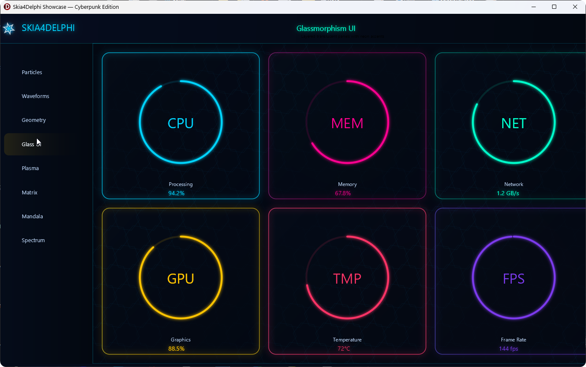
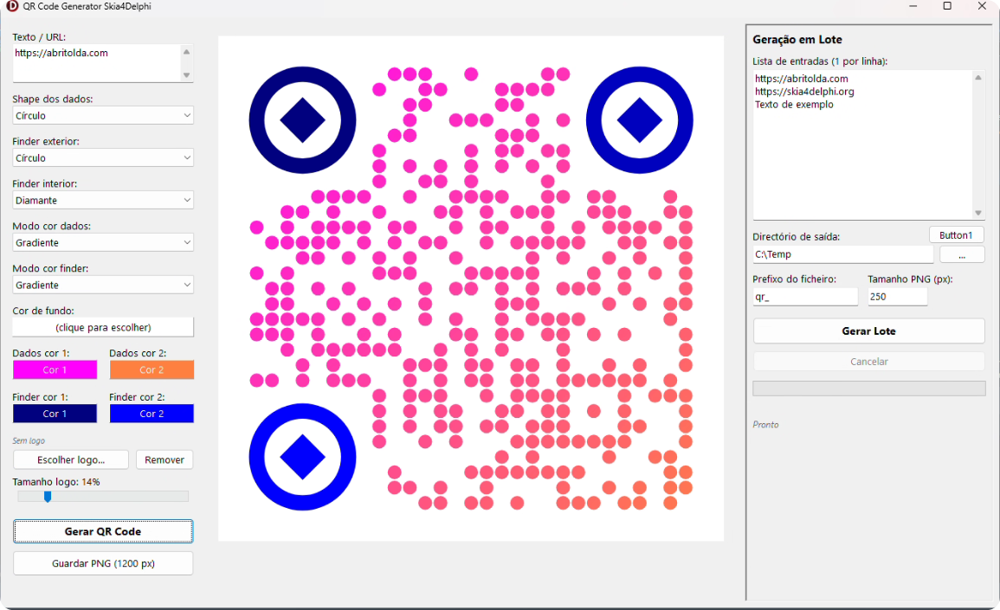
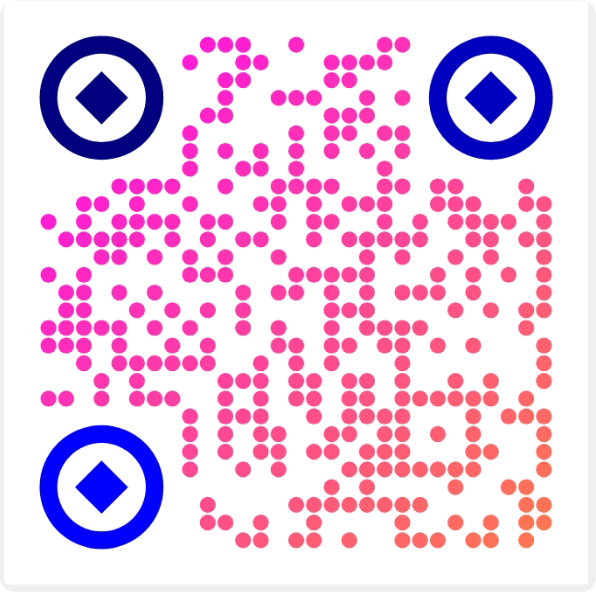
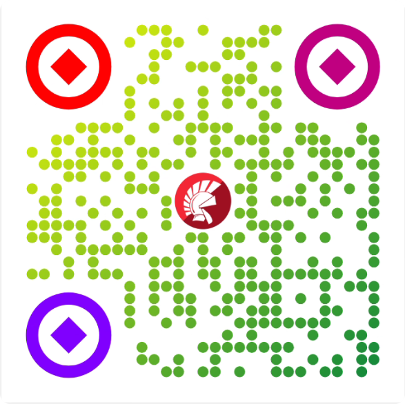
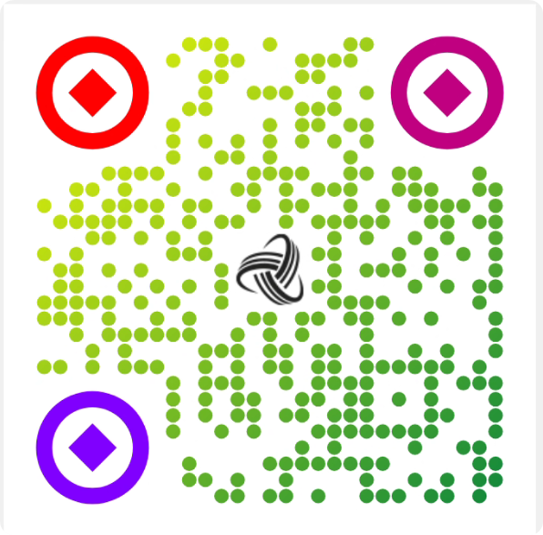
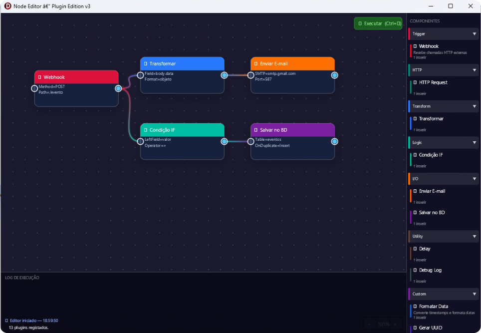
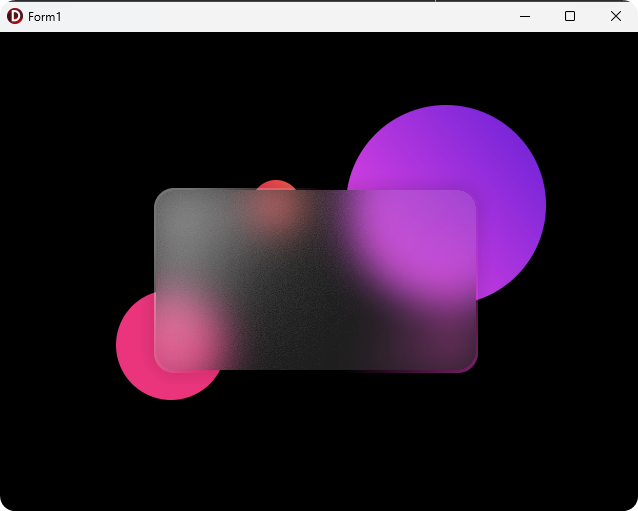
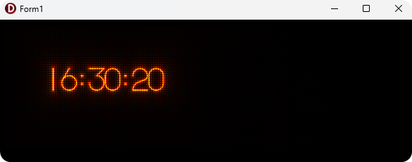
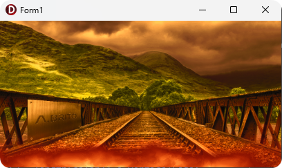
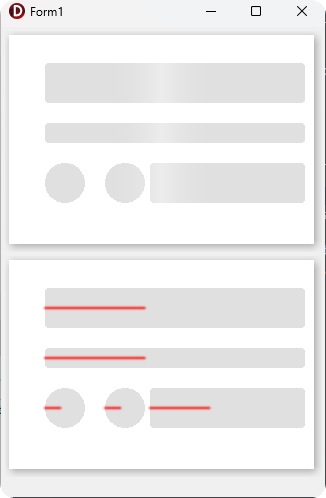

# DelphiSkiaDemos
 Some examples created in delphi with Skia4Delphi
 
 
 []
 Skia Showcase with Delphi and Skia4delphi
 
 []
 []
 []
 []

Skia Qrcode generator thread

[]

Skia node editor like n8n

[]

Skia Digital Clock Example

[]

Skia Flame Example

Skia Skeleton Loading Example
[]
